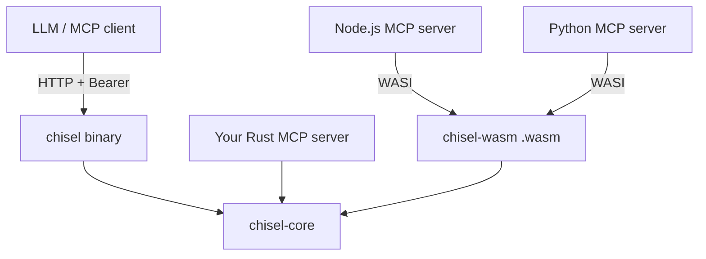
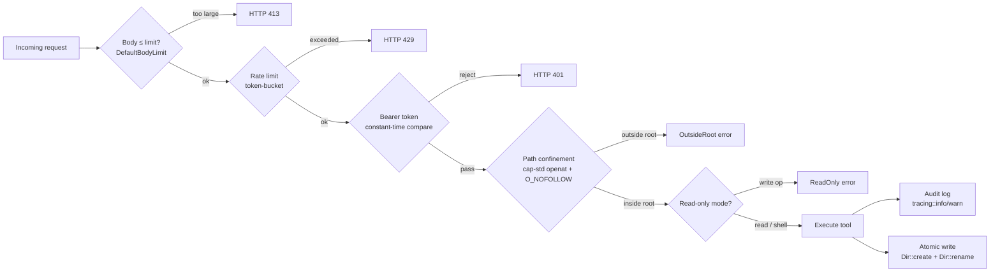

# Chisel

[](https://github.com/ckanthony/Chisel/actions/workflows/ci.yml)
[](https://codecov.io/gh/ckanthony/Chisel)


🪛 Rust powered precision file operations for agents. Unix-native tools, minimal context footprint, strict path confinement: use directly with Chisel MCP or bring your own MCP, embeddable in any MCP server in Rust, Python, Nodejs.

https://github.com/user-attachments/assets/af84f1af-db47-4e42-808b-00861504cd34

**Install** — download a pre-built [`.mcpb` bundle](https://github.com/modelcontextprotocol/mcpb) (one-click, no build step) or a raw binary from the [Releases page](https://github.com/ckanthony/Chisel/releases/latest) — see [Standalone usage](#standalone-usage) below.

---

> **Agent skill included** — [`skills/chisel/SKILL.md`](skills/chisel/SKILL.md) teaches agents how to use Chisel at maximum efficiency. Install with: `npx skills add ckanthony/Chisel`

> **Security hardened** — Verified properties across two layers: the MCP server (`chisel`) and the portable core library (`chisel-core`). See the [Security model](#security-model) section for the full breakdown.

---

## Contents

- [Motivation](#motivation)
- [Tools](#tools)
- [Standalone usage](#standalone-usage)
  - [Binary](#binary)
  - [Docker](#docker)
  - [Configure your MCP client](#configure-your-mcp-client)
- [Behind a reverse proxy](#behind-a-reverse-proxy-caddy)
- [Bring your own MCP](#bring-your-own-mcp)
- [Extending chisel](#extending-chisel)
- [Workspace layout](#workspace-layout)
- [Security model](#security-model)
- [Platform support](#platform-support)
- [Development](#development)
- [Contributing](#contributing)
- [Future considerations](#future-considerations)

---

## Motivation

Most MCP file tools hand an LLM a blank canvas: read anything, write anything, make any mistake. Chisel takes the opposite approach:

- **Reduce context overhead** — every tool call is compact. File edits go through `patch_apply`: the model sends only a unified diff instead of rewriting an entire file, so large-file edits cost a fraction of the tokens
- **Familiar command patterns** — `shell_exec` exposes the same Unix tools (`grep`, `sed`, `awk`, `find`, `cat`, …) LLMs already know well from training data, so prompts stay short and outputs are predictable
- **Precision over flexibility** — a fixed whitelist and strict path confinement mean the model cannot accidentally escape scope or run arbitrary commands
- **Safety first** — bearer-token auth, `127.0.0.1`-only binding, symlink-aware root confinement, atomic writes, and a read-only mode are all on by default
- **Reusable core** — `chisel-core` is a plain synchronous Rust library; any MCP server (Rust, Node.js via WASM, Python via WASM) can embed it without running a second process

### Real-world demo

Six tasks on the same markdown file. Left: typical MCP file server. Right: chisel.

**File:** `docs/api.md` — 300 lines, 6 headers, one section of ~20 lines.

---

**Task 1 — find all headers**

```
# Typical                                    # Chisel
tool: read_file                              tool: shell_exec
  path: /data/docs/api.md                     command: grep
                                               args: ["-n", "^#", "/data/docs/api.md"]
← 300 lines returned (~3 000 tokens)         ← 6 lines returned (~30 tokens)
  model must scan the whole file               1:# API Reference
                                              45:## Authentication
                                              89:## Endpoints
                                             134:## Request Format
                                             178:## Response Format
                                             234:## Errors
```

**Task 2 — read the content under `## Endpoints`**

```
# Typical                                    # Chisel
tool: read_file  (again, or re-use above)    tool: shell_exec
  path: /data/docs/api.md                     command: sed
                                               args: ["-n", "/^## Endpoints/,/^## /p",
← 300 lines returned again (~3 000 tokens)          "/data/docs/api.md"]
  model must locate the section in context
                                             ← 44 lines returned (~440 tokens)
                                               only the Endpoints section
```

**Task 3 — edit one line in that section**

```
# Typical                                    # Chisel
tool: write_file                             tool: patch_apply
  path: /data/docs/api.md                     path: /data/docs/api.md
  content: <entire 300-line file              patch: |
            with one line changed>              --- a/docs/api.md
                                               +++ b/docs/api.md
← 300 lines uploaded (~3 000 tokens)           @@ -91,1 +91,1 @@
  any hallucination corrupts the file          -GET /v1/items
                                               +GET /v2/items

                                             ← 7 lines uploaded (~50 tokens)
                                               hunk mismatch → PatchFailed, file untouched
```

**Task 4 — replace all `-` with `:` in that section**

```
# Typical                                    # Chisel
tool: read_file                              tool: shell_exec
  path: /data/docs/api.md                     command: sed
                                               args: ["-i", "s/-/:/g",
← 300 lines returned (~3 000 tokens)                "/data/docs/api.md"]
tool: write_file
  content: <300 lines with replacement>       ← 1 line call, 0 file content transmitted
← 300 lines uploaded (~3 000 tokens)           sed runs the replacement in-place

Total: ~12 000 tokens                        Total: ~520 tokens   (23× less)
```

**Task 5 — model tries to run `rm -rf ~`**

```
# Typical                                    # Chisel
  (no shell tool exposed)                    tool: shell_exec
                                               command: rm
                                               args: ["-rf", "~"]
  not applicable — typical MCP file
  servers have no shell tool, so the        ← CommandNotAllowed
  model would need a separate shell           "rm" is not in the whitelist.
  MCP or use write_file to script it          Permitted: grep sed awk find cat
                                               head tail wc sort uniq cut tr
                                               diff file stat ls du rg
                                             process is never spawned
```

> `rm`, `bash`, `sh`, `curl`, `chmod`, `sudo` — none of these are in the whitelist.
> The list is fixed at compile time; it cannot be extended at runtime by the model.

**Task 6 — model tries to edit `/Users/home/.ssh/config` directly**

```
# Typical                                    # Chisel
tool: write_file                             tool: patch_apply
  path: /Users/home/jor/.ssh/config               path: /Users/home/jor/.ssh/config
  content: <malicious key appended>           patch: <adds authorized_keys entry>

← succeeds if the server process            ← OutsideRoot
  has filesystem access — no path             resolved path /Users/home/.ssh/config
  confinement in a naive file server          does not start with root /data
                                             I/O is never performed
```

> Every path — including those passed to `shell_exec` — is validated against the
> configured root before any I/O or process spawn. An absolute path outside root
> is always rejected, regardless of which tool is called.

---

### Context cost comparison

Estimates use **Claude Sonnet 4.6** tokenisation: typical source code averages **~10 tokens/line** (identifiers, punctuation, and whitespace each count as tokens under BPE).

**Single edit — 500-line file, 5 lines changed:**


|                           | Naive (`read_file` → `write_file`)        | Chisel (`patch_apply`)             | Reduction |
| ------------------------- | ----------------------------------------- | ---------------------------------- | --------- |
| Tokens in (upload)        | ~5 000 (full file)                        | ~120 (11 diff lines + headers)     | **42×**   |
| Tokens out (model output) | ~5 000 (full file rewrite)                | ~15 (success ack)                  | **333×**  |
| **Round-trip total**      | **~10 000**                               | **~135**                           | **~74×**  |
| Failure mode              | Silent hallucination corrupts entire file | `PatchFailed` — original untouched | —         |


**Read / search — 2 000-line file:**


| Task                | Naive (`read_file` full)   | Chisel (`shell_exec`)             | Reduction  |
| ------------------- | -------------------------- | --------------------------------- | ---------- |
| Find a symbol       | ~20 000 tokens (full read) | ~40 tokens (`grep` matched lines) | **500×**   |
| Count occurrences   | ~20 000 tokens             | ~5 tokens (`grep -c` integer)     | **4 000×** |
| Extract lines 40–60 | ~20 000 tokens             | ~210 tokens (`sed -n '40,60p'`)   | **95×**    |
| Directory tree      | ~20 000 tokens             | ~300 tokens (`find` / `ls -R`)    | **67×**    |


> Savings scale linearly with file size. A 2 000-line file costs 4× more than the 500-line baseline above.

---

## Tools

Every path argument is canonicalized and confined to the configured root before any I/O — `..` traversal and symlink escapes are rejected. This confinement is enforced inside `chisel-core` and applies equally when the library is embedded directly.

When using the MCP server (`chisel`), all tools additionally require `Authorization: Bearer <secret>`.

| Tool               | Description                                                                                                                                   |
| ------------------ | --------------------------------------------------------------------------------------------------------------------------------------------- |
| `patch_apply`      | Apply a unified diff atomically; accepts raw or ````diff` fenced patches — **primary edit tool; sends only changed lines, not the full file** |
| `append`           | Append content to an existing file                                                                                                            |
| `write_file`       | Write (create or overwrite) a file; creates parent dirs automatically                                                                         |
| `create_directory` | Create a directory tree (`mkdir -p` semantics)                                                                                                |
| `move_file`        | Move or rename a file within root                                                                                                             |
| `shell_exec`       | Run a whitelisted command — `grep sed awk find cat head tail wc sort uniq cut tr diff file stat ls du rg`                                     |

Full reference: [docs/tools.md](docs/tools.md)

---

## Bring your own MCP

Chisel ships two embeddable libraries alongside the standalone server. Neither carries any HTTP, MCP protocol, or async runtime dependency — drop them into your own server and own the transport entirely.

| Package | What it is | Use it when |
|---|---|---|
| [`chisel-core`](chisel-core/README.md) | Pure Rust sync library — path confinement, all file ops, shell exec | Writing a Rust MCP server |
| [`chisel-wasm`](chisel-wasm/) | `chisel-core` compiled to `wasm32-wasip1` | Writing an MCP server in Node.js, Python, Deno, or any WASI runtime |

Full integration guide → **[chisel-core/README.md](chisel-core/README.md)**

---

## Standalone usage

### Binary

**Option A — Download pre-built binary (recommended)**

Go to the [latest release](https://github.com/ckanthony/Chisel/releases/latest) and download the binary for your platform:

| Platform | File |
|---|---|
| macOS Apple Silicon | `chisel-macos-arm64` |
| macOS Intel | `chisel-macos-x86_64` |
| Linux x86-64 | `chisel-linux-x86_64` |
| Linux ARM64 | `chisel-linux-arm64` |

```bash
# Make executable and run
chmod +x chisel-macos-arm64          # adjust filename for your platform
MCP_APP_SECRET=mysecret ./chisel-macos-arm64 --root /path/to/data
```

**Option B — Build from source**

```bash
cargo build --release -p chisel
```

**Running**

```bash
# Secret via env var (preferred)
MCP_APP_SECRET=mysecret ./chisel --root /path/to/data

# Or via --secret flag (env var takes precedence if both set)
./chisel --root /path/to/data --secret mysecret

# Read-only mode (shell_exec still works; writes are blocked)
MCP_APP_SECRET=mysecret ./chisel --root /path/to/data --read-only
```

The server binds to `127.0.0.1:3000` by default. Use `--port` to change the port.

### Docker

Three ways to run Chisel in Docker — pick the one that fits your workflow.

#### Option 1 — Docker Compose (recommended)

```bash
# 1. Create your .env
echo "MCP_APP_SECRET=changeme" > .env

# 2. Create the data directory that will be exposed to the LLM
mkdir -p data

# 3. Start (builds the image on first run, then stays running)
docker compose up -d

# Tail logs
docker compose logs -f

# Stop
docker compose down
```

`docker-compose.yml` mounts `./data` → `/data` inside the container and binds `127.0.0.1:3000:3000` — the port is never exposed beyond localhost.

#### Option 2 — `docker run`

```bash
# Build
docker build -t chisel:latest .

# Run (replace /absolute/path/to/data with your actual data directory)
docker run -d \
  --name chisel \
  -e MCP_APP_SECRET=changeme \
  -v /absolute/path/to/data:/data \
  -p 127.0.0.1:3000:3000 \
  --restart unless-stopped \
  chisel:latest

# Read-only mode (writes blocked, shell_exec still works)
docker run -d \
  --name chisel \
  -e MCP_APP_SECRET=changeme \
  -v /absolute/path/to/data:/data:ro \
  -p 127.0.0.1:3000:3000 \
  chisel:latest chisel --root /data --read-only
```

#### Option 3 — Custom port

```bash
docker run -d \
  --name chisel \
  -e MCP_APP_SECRET=changeme \
  -v /absolute/path/to/data:/data \
  -p 127.0.0.1:8080:3000 \
  chisel:latest
```

Host port `8080` maps to container port `3000`. Update your MCP client URL to `http://127.0.0.1:8080/mcp` accordingly.

> The container runs as a non-root user (`chisel`) and never binds on `0.0.0.0`. For remote access, place Caddy or nginx in front — see [Behind a reverse proxy](#behind-a-reverse-proxy-caddy).

### Configure your MCP client

```json
{
  "mcpServers": {
    "chisel": {
      "url": "http://127.0.0.1:3000/mcp",
      "headers": {
        "Authorization": "Bearer <your-secret>"
      }
    }
  }
}
```

---

## Behind a reverse proxy (Caddy)

Chisel deliberately refuses to bind on `0.0.0.0`. Remote or multi-client access goes through a reverse proxy that handles TLS.

### Caddy — automatic HTTPS

```caddy
mcp.yourdomain.com {
    reverse_proxy 127.0.0.1:3000
}
```

Caddy auto-provisions a Let's Encrypt certificate. The bearer token still authenticates every request end-to-end.

```bash
# Install Caddy (macOS)
brew install caddy

# Run
caddy run --config Caddyfile
```

Your MCP client URL becomes `https://mcp.yourdomain.com/mcp`.

### nginx

```nginx
server {
    listen 443 ssl;
    server_name mcp.yourdomain.com;

    ssl_certificate     /etc/letsencrypt/live/mcp.yourdomain.com/fullchain.pem;
    ssl_certificate_key /etc/letsencrypt/live/mcp.yourdomain.com/privkey.pem;

    location / {
        proxy_pass http://127.0.0.1:3000;
        proxy_set_header Host $host;
    }
}
```

---

## Extending chisel

See **[chisel-core/README.md](chisel-core/README.md)** for the full integration guide covering:

- Rust API reference with code examples
- `spawn_blocking` pattern for async handlers
- Node.js (≥ 22) WASM / WASI integration
- Python (`wasmtime-py`) WASM integration
- Error types and security properties

---

## Workspace layout

```
chisel/
├── chisel/          # HTTP server binary (MCP Streamable HTTP transport)
├── chisel-core/     # Portable sync library — no HTTP, no async, no MCP protocol
└── chisel-wasm/     # wasm32-wasip1 build of chisel-core for Node.js / Python / Deno
```



---

## Security model

Security properties are split across two layers. Each row is verified by the test suite referenced at the bottom of this section.

### `chisel` — MCP server / HTTP layer


| #   | Property                                                     | Mechanism                                                                                            | Default   |
| --- | ------------------------------------------------------------ | ---------------------------------------------------------------------------------------------------- | --------- |
| 1   | **Bearer-token auth** — every request authenticated          | `subtle::ConstantTimeEq`; timing-safe comparison; missing or empty secret → process exits at startup | required  |
| 2   | **Rate limiting** — brute-force and runaway-agent protection | `governor` token-bucket; excess requests → `HTTP 429` before auth is checked                         | 100 req/s |
| 3   | **Request body cap** — memory exhaustion prevention          | `axum::DefaultBodyLimit`; oversized body → `HTTP 413` before any parsing                             | 4 MiB     |
| 4   | **Audit log** — every tool op traceable                      | `tracing::info` on success, `tracing::warn` on failure; records op name, path, error                 | `info`    |
| 5   | **Loopback-only binding** — no accidental public exposure    | `TcpListener::bind("127.0.0.1:<port>")`; `0.0.0.0` is never used                                     | —         |


### `chisel-core` — portable library (enforced on every op, including embedded use)


| #   | Property                                                                                       | Mechanism                                                                                                                                                                       |
| --- | ---------------------------------------------------------------------------------------------- | ------------------------------------------------------------------------------------------------------------------------------------------------------------------------------- |
| 6   | **Kernel-enforced root confinement** — directory traversal, symlink escape, TOCTOU all blocked | `cap_std::fs::Dir`; every path component traversed via `openat(fd, component, O_NOFOLLOW)`; confinement is enforced at the kernel level during I/O, not in userspace before it  |
| 7   | **Atomic writes** — failed patch never corrupts the target file                                | `Dir::create(".name.PID.tmp")` + `Dir::rename(tmp → target)`; both ops confined inside the same root fd; on any failure the tmp file is discarded and the original is untouched |
| 8   | **Read-only mode** — blanket write protection                                                  | `check_writable(read_only)` runs before any I/O inside every write op; no code path bypasses it                                                                                 |
| 9   | **Shell whitelist + direct `execve`** — no injection, no arbitrary commands                    | Fixed compile-time whitelist; `std::process::Command` spawns directly (no `sh -c`); path-like args validated via `validate_path` before spawn                                   |





### Attack and misuse prevention

Each layer targets a specific class of failure — accidental or deliberate.

#### 1. Authentication — unauthorised access

Every HTTP request must carry `Authorization: Bearer <secret>`. The comparison uses `subtle::ConstantTimeEq`, which takes the same number of CPU cycles regardless of how many characters match. A timing-based brute-force attack that probes the token character-by-character cannot succeed because no timing signal leaks.

The server refuses to start if the secret is empty or absent — misconfiguration is a hard error, not a silent fallback to no auth.

#### 2. Path confinement — escape from root directory

This is the core guarantee. All filesystem tools (`patch_apply`, `append`, `write_file`, `create_directory`, `move_file`) operate exclusively through a `cap_std::fs::Dir` handle rooted at the configured root directory.

```
input string
  → strip root prefix → relative path
  → cap_std::fs::Dir::open / write / rename …
       └─ kernel: openat(root_fd, "sub/file", O_NOFOLLOW)
                  openat(sub_fd,  "file",     O_NOFOLLOW)
```

Every component of the path is traversed via `openat` with `O_NOFOLLOW`. The kernel enforces confinement — no userspace prefix check can be bypassed:


| Attack               | Example input                                           | What happens                                                                 |
| -------------------- | ------------------------------------------------------- | ---------------------------------------------------------------------------- |
| Directory traversal  | `/data/sub/../../etc/passwd`                            | `..` components tracked per-fd; escape above root blocked by kernel → error  |
| Absolute path bypass | `/etc/hosts`                                            | Root prefix stripped; remaining path confined to root fd → `OutsideRoot`     |
| Symlink in component | `/data/link/file` where `link → /etc`                   | `O_NOFOLLOW` on `link` open → kernel rejects → error                         |
| TOCTOU swap          | Valid path at check time, swapped to symlink before I/O | No separate check/use window — confinement is enforced during the I/O itself |


`validate_path` (the userspace canonicalize + prefix check from earlier versions) is still used exclusively for `shell_exec` path arguments, where we pass strings to spawned processes that `cap-std` cannot confine.

#### 3. Shell injection — arbitrary command execution

`shell_exec` does **not** invoke a shell interpreter. It calls `std::process::Command` directly with the command and arguments as separate OS-level strings:

```
shell_exec("grep", ["-r", "foo", "/data"])
  → execve("/usr/bin/grep", ["-r", "foo", "/data"])   ← no sh -c wrapper
```

Shell metacharacters (`;`, `&&`, `|`, `$()`, backticks, etc.) in any argument are passed as literal bytes to the target process. There is no shell to interpret them.

A fixed compile-time whitelist (`grep sed awk find cat head tail wc sort uniq cut tr diff file stat ls du rg`) is checked before the process is spawned. Any command not on the list returns `CommandNotAllowed` immediately — the process is never started.

Path-like arguments (starting with `/` or containing `..`) are validated against root via `validate_path` before the process starts.

#### 4. Partial write — file corruption on failed patch

`patch_apply` never writes directly to the target file. The flow is entirely confined within the `cap-std` Dir:

```
1. Parse and validate the diff
2. Dir::create(".filename.PID.tmp")   ← confined temp file, same directory
3. On success  → Dir::rename(tmp, target)   ← single syscall, cannot be interrupted mid-write
4. On failure  → return PatchFailed, tmp is dropped and cleaned up
```

If the hunk context does not match the current file (the file has drifted since the diff was generated), the operation aborts at step 1 and the original file is never touched. A process crash between steps 2 and 3 leaves the `.tmp` file — the original is still intact.

#### 5. Read-only mode — blanket write protection

Starting with `--read-only` causes all five write tools (`patch_apply`, `append`, `write_file`, `create_directory`, `move_file`) to return `ReadOnly` immediately without performing any I/O. The check happens inside `chisel-core` before any disk access — there is no code path that bypasses it.

`shell_exec` remains available in read-only mode because it only reads (whitelisted commands are all inspection tools; `mkdir` and `mv` are explicitly excluded from the whitelist).

#### 6. Rate limiting — brute-force and runaway-agent protection

Every request passes through a token-bucket rate limiter (`governor`) before authentication. When the configured rate (default: **100 req/s**) is exceeded, the server immediately returns `HTTP 429 Too Many Requests` without doing any work.

This prevents two threat classes:

- **Token brute-force**: an attacker cannot enumerate tokens faster than the configured rate, even with a leaked secret in partial form.
- **Runaway agent loops**: a malfunctioning LLM client flooding the server is throttled before it can cause resource exhaustion.

Configure with `--rate-limit <N>` (or set to `0` to disable). The limiter is the outermost layer — requests that exceed the rate never reach the auth check.

#### 7. Request body cap — memory exhaustion prevention

All incoming request bodies are capped at **4 MiB** by default (`DefaultBodyLimit`). An oversized body is rejected before any parsing, authentication, or tool dispatch occurs.

Configure with `--body-limit <bytes>`. For typical LLM usage (unified diffs and file content), 4 MiB is generous — increase only if you intentionally send large file writes.

#### 8. Audit logging — operation traceability

Every tool invocation emits a structured `tracing` log line recording the operation name, the target path (or command), and whether it succeeded or failed:

```
INFO chisel::tools::filesystem op=patch_apply path=/data/foo.txt
WARN chisel::tools::filesystem op=write_file  path=/etc/passwd error=OutsideRoot { ... }
INFO chisel::tools::shell       op=shell_exec cmd=grep exit_code=0
```

Log verbosity is controlled via the `RUST_LOG` environment variable (e.g. `RUST_LOG=chisel=debug`). The default level is `info`, which captures every tool call result without flooding output with framework internals.

#### 9. Network exposure — no accidental public binding

The server calls `TcpListener::bind("127.0.0.1:<port>")` — not `0.0.0.0`. It is impossible for the process itself to accept connections from outside the machine. Remote access must be deliberately routed through a reverse proxy (Caddy, nginx), which is where TLS termination and any additional access controls live.

The Docker image runs as a non-root user (`mcp`) and the `docker-compose.yml` maps the port as `127.0.0.1:3000:3000`, preserving the loopback restriction even inside a container.

### Security test coverage

Every property above is verified by a dedicated test suite at `[chisel/tests/security.rs](chisel/tests/security.rs)`.
Run with `cargo test --test security -p chisel`.


| Property                | Tests                                                                                                                                                                                                                                            |
| ----------------------- | ------------------------------------------------------------------------------------------------------------------------------------------------------------------------------------------------------------------------------------------------ |
| **§1 Authentication**   | `auth_missing_secret_is_hard_error` · `auth_empty_secret_is_hard_error` · `auth_missing_header_returns_401` · `auth_wrong_token_returns_401` · `auth_basic_scheme_returns_401` · `auth_prefix_of_secret_returns_401` · `auth_valid_token_passes` |
| **§2 Path confinement** | `path_directory_traversal_is_blocked` · `path_absolute_outside_root_returns_outside_root_error` · `path_symlink_in_component_is_blocked` · `path_toctou_symlink_swap_is_blocked` · `path_deeply_nested_outside_root_is_blocked`                  |
| **§3 Shell injection**  | `shell_dangerous_commands_blocked_before_spawn` · `shell_metacharacters_are_literal` · `shell_path_arg_outside_root_blocked_before_spawn` · `shell_traversal_in_arg_blocked_before_spawn`                                                        |
| **§4 Partial write**    | `partial_write_failed_patch_leaves_file_intact` · `partial_write_no_tmp_artefact_on_failure`                                                                                                                                                     |
| **§5 Read-only mode**   | `readonly_all_write_tools_are_blocked` · `readonly_shell_exec_remains_available` · `readonly_no_disk_mutation_occurs`                                                                                                                            |
| **§6 Network binding**  | `network_bind_address_is_loopback_only` · `network_sse_endpoint_returns_404`                                                                                                                                                                     |


All 23 tests pass on every CI run. A failure means a documented security guarantee has regressed.

```
$ cargo test --test security -p chisel
running 23 tests
test auth_empty_secret_is_hard_error ... ok
test auth_missing_secret_is_hard_error ... ok
test network_bind_address_is_loopback_only ... ok
test path_absolute_outside_root_returns_outside_root_error ... ok
test path_deeply_nested_outside_root_is_blocked ... ok
test readonly_all_write_tools_are_blocked ... ok
test readonly_no_disk_mutation_occurs ... ok
test path_directory_traversal_is_blocked ... ok
test shell_dangerous_commands_blocked_before_spawn ... ok
test shell_path_arg_outside_root_blocked_before_spawn ... ok
test path_symlink_in_component_is_blocked ... ok
test shell_traversal_in_arg_blocked_before_spawn ... ok
test partial_write_failed_patch_leaves_file_intact ... ok
test partial_write_no_tmp_artefact_on_failure ... ok
test path_toctou_symlink_swap_is_blocked ... ok
test readonly_shell_exec_remains_available ... ok
test shell_metacharacters_are_literal ... ok
test auth_missing_header_returns_401 ... ok
test auth_valid_token_passes ... ok
test auth_basic_scheme_returns_401 ... ok
test auth_prefix_of_secret_returns_401 ... ok
test auth_wrong_token_returns_401 ... ok
test network_sse_endpoint_returns_404 ... ok

test result: ok. 23 passed; 0 failed
```

---

## Development

```bash
# Run all tests
cargo test --workspace

# Run only the server tests
cargo test -p chisel

# Build the WASM target
rustup target add wasm32-wasip1
cargo build --target wasm32-wasip1 -p chisel-wasm

# Build Docker image
docker build -t chisel:dev .
```

---

## Platform support


| Platform                     | Server binary (`chisel`) | `chisel-core` (lib, no shell) | `chisel-wasm` |
| ---------------------------- | ------------------------ | ----------------------------- | ------------- |
| Linux (x86_64, arm64)        | ✅ Full support           | ✅                             | ✅             |
| macOS (Apple Silicon, Intel) | ✅ Full support           | ✅                             | ✅             |
| Windows                      | ❌ Not supported          | ⚠️ Compiles, untested         | ✅             |


**Linux / macOS** — primary targets. All nine security properties hold. Docker image is Debian-based. `shell_exec` whitelist (`grep`, `sed`, `awk`, `find`, `cat`, `ls`, …) assumes a standard Unix environment.

**Windows** — not supported for the server binary for three reasons:

1. `shell_exec` whitelist is entirely Unix tools; most do not exist natively on Windows
2. `cap-std` kernel confinement uses POSIX `openat + O_NOFOLLOW` semantics; Win32 reparse-point / junction handling differs
3. Symlink creation requires elevated privileges (`SeCreateSymbolicLinkPrivilege`) — security tests cannot run without Administrator or Developer Mode

`**chisel-wasm`** — fully portable. WASM has no OS dependency; runs identically on any WASI-capable runtime (Node.js ≥ 22, Deno, Wasmtime) regardless of host OS. `shell_exec` is excluded from the WASM build.

---

## Contributing

Contributions are welcome. A few guidelines:

- **Bug fixes and small improvements** — open a PR directly.
- **New tools or behaviour changes** — open an issue first to agree on scope before writing code.
- **Security issues** — do not open a public issue. File a private report and include reproduction steps.

Before submitting:

```bash
cargo test --workspace          # all tests must pass
cargo test --test security -p chisel   # security suite must be green
cargo clippy --workspace -- -D warnings
cargo fmt --check
```

New security-relevant code should come with a matching test in `chisel/tests/security.rs` that names the exact attack vector it covers.

---

## Future considerations

### S3 / R2 object storage backend

A potential extension is a thin sync layer that hydrates S3 or R2 objects into a local scratch directory (RAM-backed or `tmpfs`), runs all Chisel operations against that directory through the normal `chisel-core` path, then flushes changed objects back on completion.

The agent would interact exclusively with Chisel — path confinement, atomic patching, and shell tooling all behave identically. S3/R2 would serve purely as the persistence layer, transparent to the model.

Open problems before this is viable: concurrent writes to the same object need optimistic locking (ETag-based check-and-swap on flush), and a native `cap-std` equivalent does not exist for object storage, so confinement must be enforced at the scratch directory level rather than the storage layer. The core `shell_exec` whitelist also assumes a Unix filesystem and would require the object to be fully materialized locally before any command runs.
