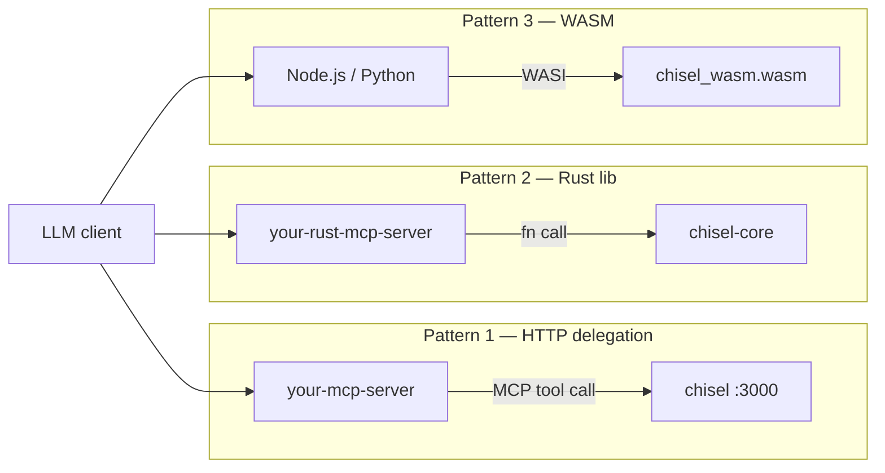

# Extensibility

`chisel` is designed so that other MCP servers — in any language — can reuse its file operation logic without re-implementing path confinement or patching.

Three integration patterns, from least to most coupling:



---

## Pattern 1 — HTTP delegation (any language)

Run `chisel` as a sidecar. Your server owns the MCP session with the LLM and calls chisel's tools internally using the official MCP SDK client. The LLM never talks to chisel directly.

```
LLM  ──MCP──▶  your-mcp-server  ──MCP/HTTP──▶  chisel :3000
```

**When to use:** Node.js, Python, Go, or any language. No build changes. Zero performance concerns on localhost — a chisel tool call is a sub-millisecond round-trip.

**Isolation:** Each chisel instance has one `--root`. To give different callers different roots, run multiple instances on different ports with different secrets.

### Architecture

Your server creates a `chisel` client once at startup, then wraps each chisel tool in a thin helper. Your own MCP tools call those helpers — chisel enforces path confinement and atomicity transparently.

---

### Node.js example

Full source: [`examples/nodejs-mcp-server/server.mjs`](../examples/nodejs-mcp-server/server.mjs)

```bash
# install deps
cd examples/nodejs-mcp-server && npm install

# terminal 1 — start chisel
MCP_APP_SECRET=mysecret chisel --root /path/to/project

# terminal 2 — start your server
CHISEL_SECRET=mysecret CHISEL_ROOT=/path/to/project node server.mjs
```

**Key wiring** — connect to chisel at startup, then delegate:

```js
import { Client } from "@modelcontextprotocol/sdk/client/index.js";
import { StreamableHTTPClientTransport } from "@modelcontextprotocol/sdk/client/streamableHttp.js";

// Connect once at startup
const chisel = new Client({ name: "my-server", version: "1.0.0" });
await chisel.connect(
  new StreamableHTTPClientTransport(new URL("http://127.0.0.1:3000/mcp"), {
    requestInit: {
      headers: { Authorization: `Bearer ${process.env.CHISEL_SECRET}` },
    },
  })
);

// Thin helpers
const chiselWriteFile = (path, content) =>
  chisel.callTool({ name: "write_file", arguments: { path, content } });

const chiselShellExec = (command, args) =>
  chisel.callTool({ name: "shell_exec", arguments: { command, args } });
```

**Your tool — calls chisel internally:**

```js
server.tool(
  "scaffold_component",
  "Scaffold a new React TypeScript component file",
  { name: z.string(), directory: z.string() },
  async ({ name, directory }) => {
    const path    = `${CHISEL_ROOT}/${directory}/${name}.tsx`;
    const content = `export function ${name}() {\n  return <div />\n}\n`;

    // chisel enforces path confinement + atomic write — you get it for free
    const result = await chiselWriteFile(path, content);
    return { content: [{ type: "text", text: result.content[0].text }] };
  }
);
```

---

### Python example

Full source: [`examples/python-mcp-server/server.py`](../examples/python-mcp-server/server.py)

```bash
# install deps
cd examples/python-mcp-server && pip install -r requirements.txt

# terminal 1 — start chisel
MCP_APP_SECRET=mysecret chisel --root /path/to/project

# terminal 2 — start your server
CHISEL_SECRET=mysecret CHISEL_ROOT=/path/to/project python server.py
```

**Key wiring** — open a chisel session per call (stateless, safe for concurrent tools):

```python
from mcp import ClientSession
from mcp.client.streamable_http import streamablehttp_client

CHISEL_URL    = "http://127.0.0.1:3000/mcp"
CHISEL_HEADERS = {"Authorization": f"Bearer {os.environ['CHISEL_SECRET']}"}

async def _chisel_call(tool: str, **kwargs) -> str:
    async with streamablehttp_client(CHISEL_URL, headers=CHISEL_HEADERS) as (read, write, _):
        async with ClientSession(read, write) as session:
            await session.initialize()
            result = await session.call_tool(tool, kwargs)
            return result.content[0].text

async def chisel_write_file(path: str, content: str) -> str:
    return await _chisel_call("write_file", path=path, content=content)
```

**Your tool — calls chisel internally:**

```python
from mcp.server.fastmcp import FastMCP

mcp = FastMCP("my-project-server")

@mcp.tool()
async def scaffold_module(name: str, directory: str) -> str:
    """Scaffold a new Python module with a class stub."""
    path    = f"{CHISEL_ROOT}/{directory}/{name}.py"
    content = f"class {name.title()}:\n    pass\n"

    # chisel enforces path confinement — OutsideRoot raised before any I/O
    return await chisel_write_file(path, content)

if __name__ == "__main__":
    mcp.run()
```

---

## Pattern 2 — Rust library (`chisel-core`)

Add `chisel-core` as a Cargo dependency. You get path validation, all file ops, and `shell_exec` (native only) as plain synchronous functions — no HTTP, no MCP protocol, no async runtime required.

```toml
# your-mcp-server/Cargo.toml
[dependencies]
chisel-core = { path = "../chisel-core" }   # or published crate path
```

```rust
use chisel_core::ops::filesystem::write_file;
use std::path::Path;

let root = Path::new("/data");
write_file(root, "/data/output.txt", "hello", false)?;
```

**When to use:** Rust MCP servers that want zero-overhead embedding of the same security semantics.

**Note:** All functions are synchronous. Wrap in `tokio::task::spawn_blocking` if calling from an async context.

---

## Pattern 3 — WASM/WASI (`chisel-wasm`)

The `chisel-wasm` crate compiles `chisel-core` to `wasm32-wasip1`. Any runtime with WASI support (Node.js ≥ 22, Deno, Wasmtime) can load the `.wasm` artifact and call file operations directly — no HTTP hop, no native binary.

**Available:** `validate_path`, `patch_apply`, `append`, `write_file`, `create_directory`, `move_file`

**Not available:** `shell_exec` — process spawning is not a WASI capability.

### Build

```bash
rustup target add wasm32-wasip1
cargo build --release --target wasm32-wasip1 -p chisel-wasm
# artifact: target/wasm32-wasip1/release/chisel_wasm.wasm
```

### Node.js (≥ 22) loader

```js
import { readFile } from "node:fs/promises";
import { WASI } from "node:wasi";

const wasi = new WASI({
  version: "preview1",
  preopens: { "/data": "/path/to/your/project" },
});

const wasm     = await WebAssembly.compile(await readFile("./chisel_wasm.wasm"));
const instance = await WebAssembly.instantiate(wasm, wasi.getImportObject());
wasi.start(instance);

// Exported functions: write_file, patch_apply, append, create_directory, move_file
// are now available on instance.exports
```

**When to use:** Node.js/Deno MCP servers that want to embed file operation logic without running a sidecar process, with the same path-confinement guarantees as native `chisel`.
